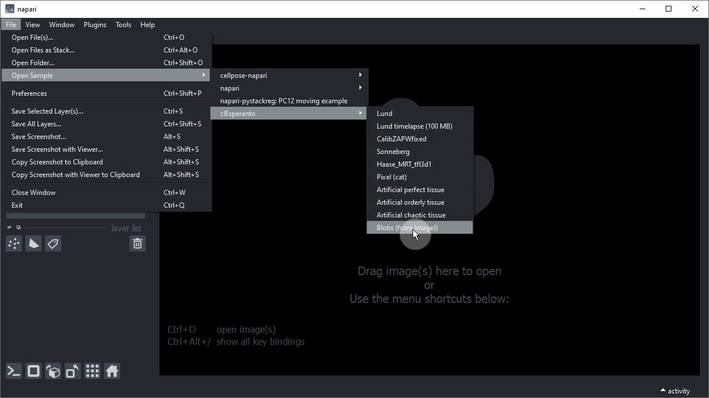
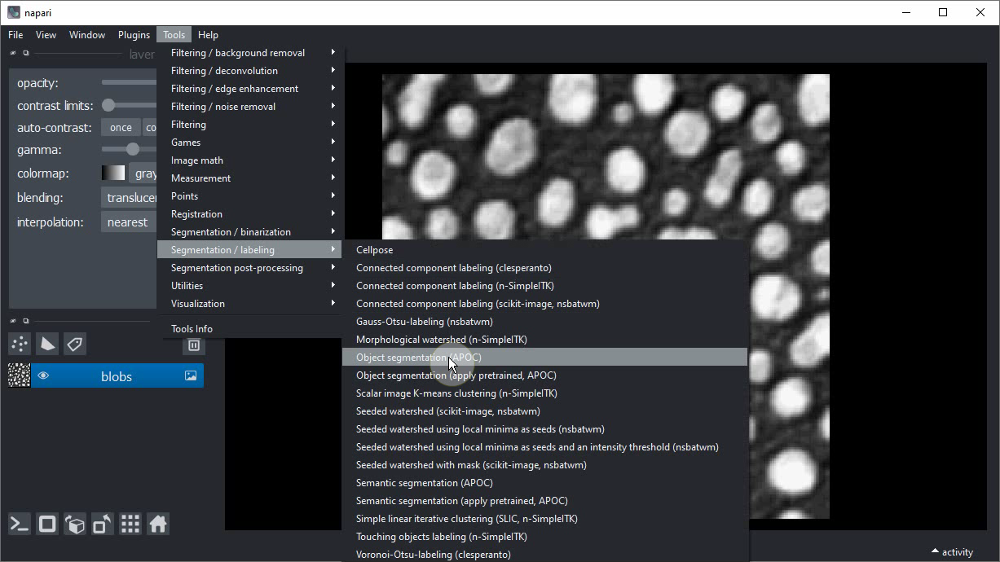
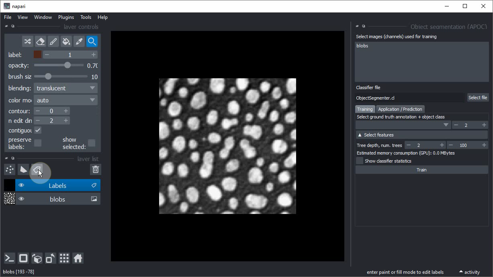
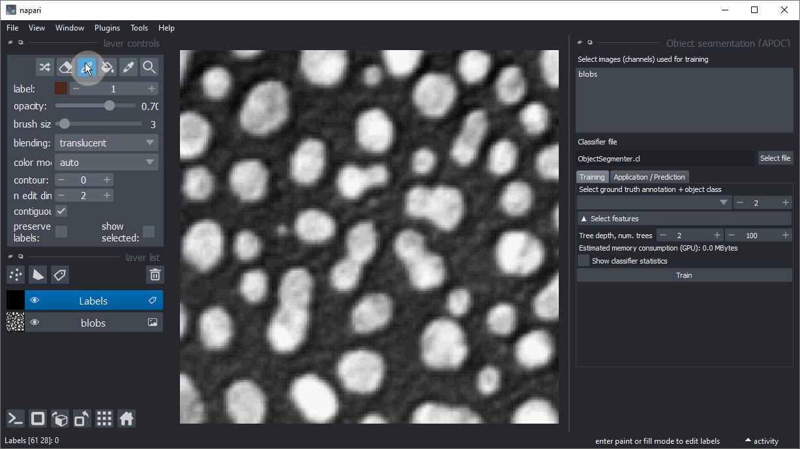
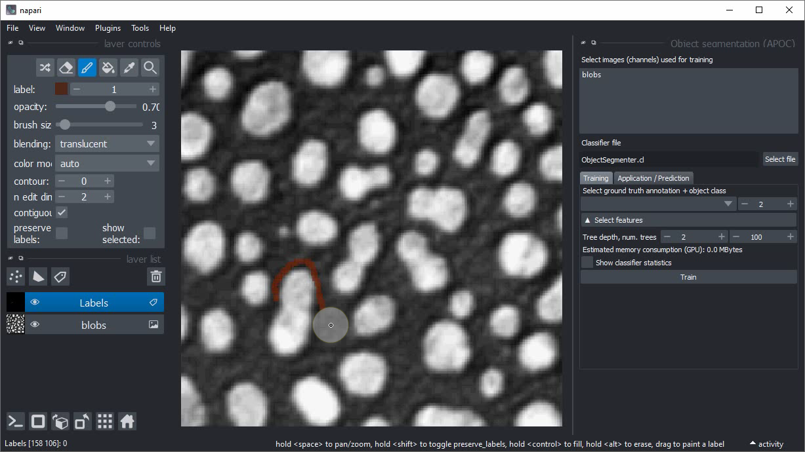
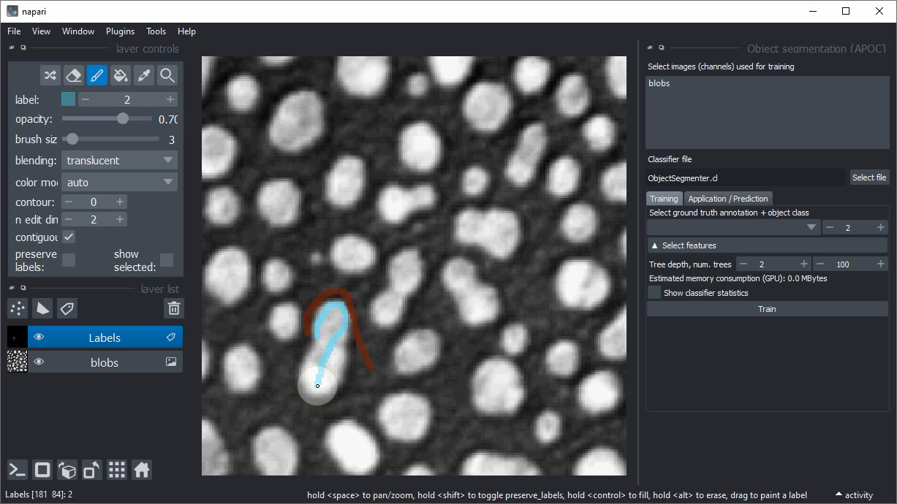

(machine_learning:pixel_classification)=
# Classification interactive des pixels et segmentation d'objets dans Napari

Dans cet exercice, nous allons entraîner un [Classificateur de forêt aléatoire](https://fr.wikipedia.org/wiki/For%C3%AAt_al%C3%A9atoire) pour la classification des pixels et convertir le résultat en une segmentation d'instances.
Nous utiliserons le plugin napari [napari-accelerated-pixel-and-object-classification](https://www.napari-hub.org/plugins/napari-accelerated-pixel-and-object-classification).

## Pour commencer

Ouvrez une fenêtre de terminal et activez votre environnement conda :

```
conda activate devbio-napari-env
```

Ensuite, lancez Napari :

```
napari
```

Chargez le jeu de données d'exemple "Blobs" à partir du menu `File > Open Sample > clEsperanto > Blobs (from ImageJ)`



## Classification des pixels et segmentation d'objets dans Napari

Pour segmenter des objets, nous pouvons utiliser l'outil de segmentation d'objets dans APOC. 
En coulisses, il utilise un classificateur de pixels et un [étiquetage des composantes connexes](https://fr.wikipedia.org/wiki/%C3%89tiquetage_en_composantes_connexes). 
La procédure suivante est également montrée dans [cette vidéo](apoc_object_segmentation.mp4).

Lancez la segmentation d'objets à partir du menu `Tools > Segmentation / Labeling > Object Segmentation (APOC)`.



Ajoutez une nouvelle couche d'étiquettes en cliquant sur ce bouton :


Changez la taille du pinceau à un petit nombre comme 2 ou 3.


Cliquez sur le bouton `Paint brush`.


Commencez à annoter la région `background` où il n'y a pas d'objet.


Augmentez l'étiquette dessinée de un.


Dessinez une annotation à l'intérieur des objets d'intérêt. Dessinez les annotations de fond et d'objet proches l'une de l'autre. Plus ces deux annotations sont dessinées proches, plus le degré de liberté que l'ordinateur a lors de l'optimisation du modèle plus tard est faible.


Dans l'interface utilisateur `Object segmentation` à droite, sélectionnez l'image/canal qui doit être traité.


Sélectionnez également l'image d'étiquettes d'annotation que vous venez de dessiner.


Cliquez sur `Train`. Une image d'étiquettes devrait apparaître.


Si la segmentation fonctionne bien, envisagez de sauvegarder le fichier `ObjectSegmenter.cl` qui a été enregistré. 
Si vous n'avez pas changé l'emplacement du fichier avant l'entraînement, il se trouvera dans le dossier à partir duquel vous avez lancé napari en ligne de commande.