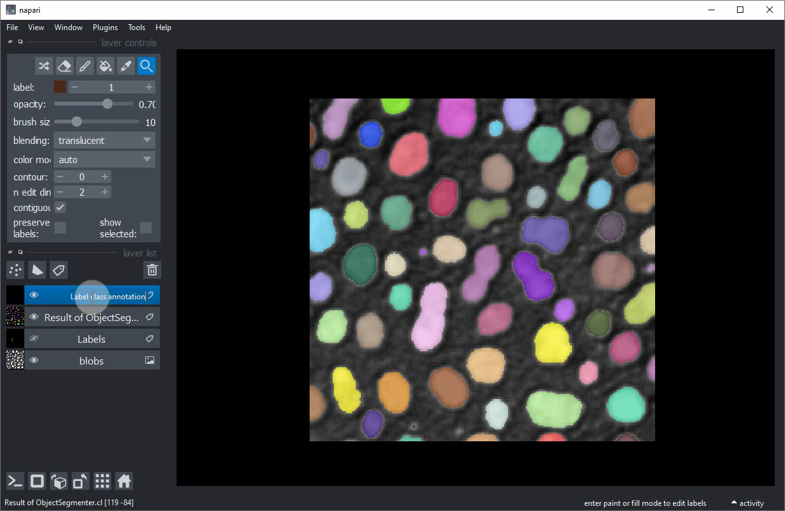
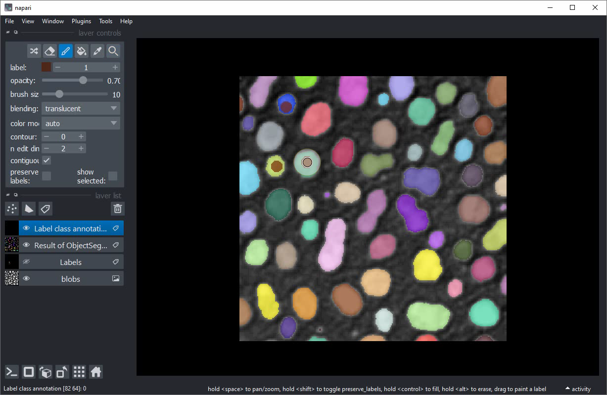
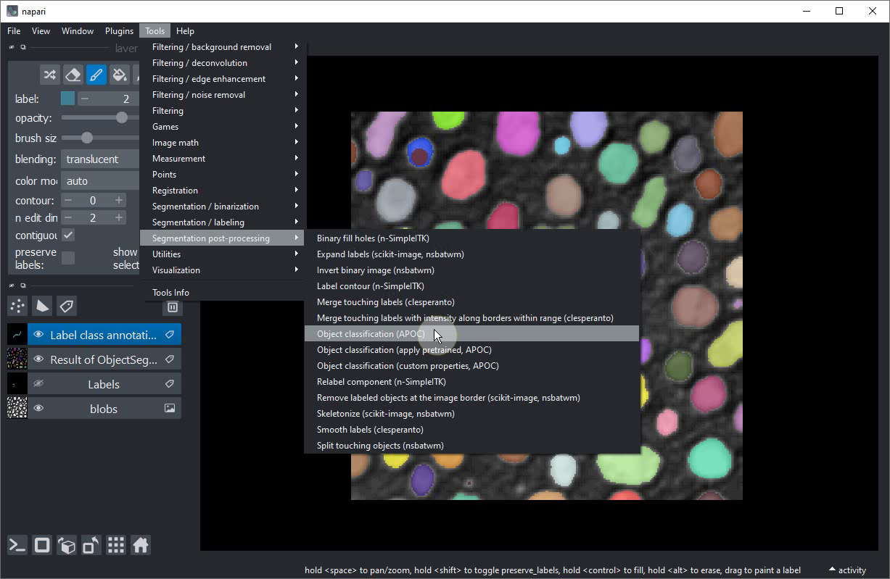
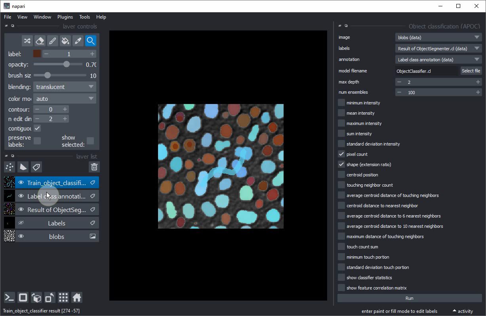
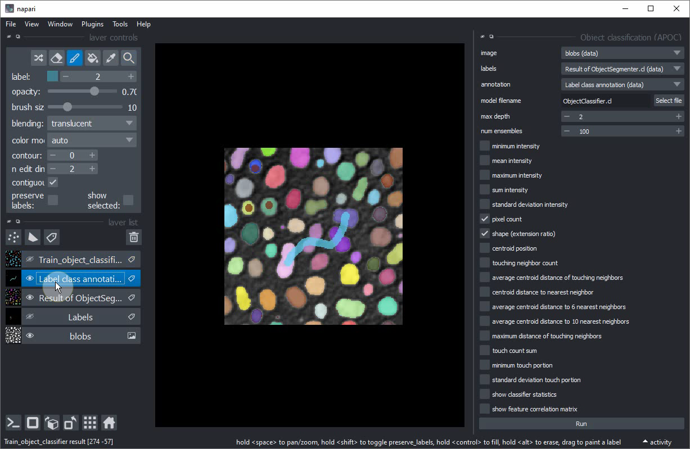
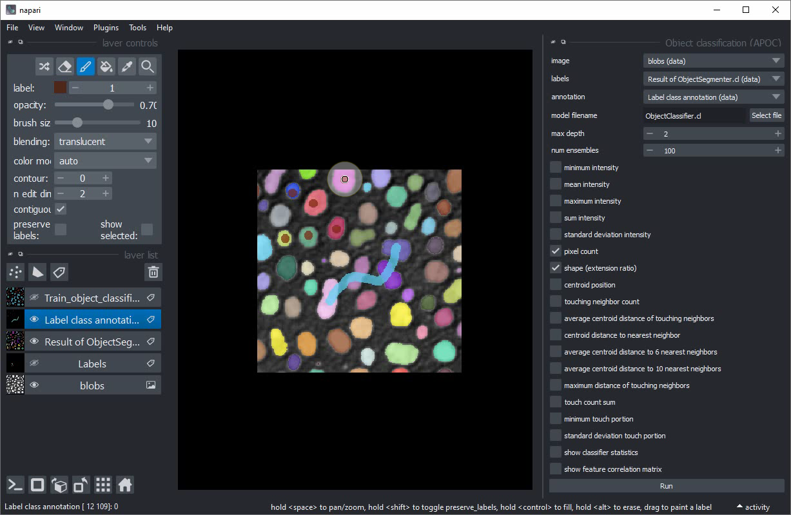

# Classification interactive d'objets dans Napari

Dans cet exercice, nous allons entraîner des [Classificateurs de Forêt Aléatoire](https://fr.wikipedia.org/wiki/For%C3%AAt_al%C3%A9atoire) pour classer des objets segmentés.
Nous utiliserons le plugin napari [napari-accelerated-pixel-and-object-classification](https://www.napari-hub.org/plugins/napari-accelerated-pixel-and-object-classification).

## Pour commencer

Ouvrez une fenêtre de terminal et activez votre environnement conda :

```
conda activate devbio-napari-env
```

Ensuite, lancez Napari :

```
napari
```

Chargez le jeu de données d'exemple "Blobs" à partir du menu `Fichier > Ouvrir un échantillon > clEsperanto > Blobs (de ImageJ)`

Nous avons également besoin d'une image étiquetée. Vous pouvez la créer en utilisant le [classificateur de pixels entraîné précédemment](machine_learning:pixel_classification)
ou en utilisant le menu `Outils > Segmentation / étiquetage > Étiquetage Gauss-Otsu (clesperanto)`.

## Classification d'objets

Notre point de départ est une image chargée et une image étiquetée avec des objets segmentés. La procédure suivante est également montrée dans [cette vidéo](apoc_object_classification.mp4).


Ajoutez une autre image étiquetée. Renommez l'image étiquetée par exemple en `Annotation de classe d'étiquettes` pour ne pas la confondre avec l'autre.


Activez l'`Outil Pinceau`.


Mettez de petits points avec l'étiquette `1` dans les petits objets arrondis (à des fins d'entraînement : vraiment juste les plus petits).


Augmentez l'`étiquette` à `2`.


Dessinez une ligne à travers les objets allongés plus grands au centre de l'image.


Lancez l'outil de classification d'objets à partir du menu `Outils > Post-traitement de segmentation > Classification d'objets (APOC)`


Dans cette interface utilisateur, activez la case à cocher `forme`.


Sélectionnez `image`, `étiquettes` et `annotation` comme ceci :


Cliquez sur `Exécuter`. Après une seconde, une nouvelle couche d'étiquettes avec des objets annotés en marron / bleu devrait apparaître. Certains objets ronds plus grands seront bleus involontairement.


Masquez la couche de classification nouvellement créée.


Sélectionnez votre couche d'annotation.


Annotez quelques objets ronds supplémentaires, cette fois les plus grands.


Entraînez à nouveau le classificateur.


Si vous êtes satisfait du classificateur entraîné, copiez le fichier dans un endroit sûr. Lors de l'entraînement du prochain classificateur, celui-ci pourrait être écrasé.

## Exercice supplémentaire
Réentraînez le classificateur pour qu'il puisse différencier trois classes différentes :
* Petits objets ronds
* Grands objets ronds
* Grands objets allongés