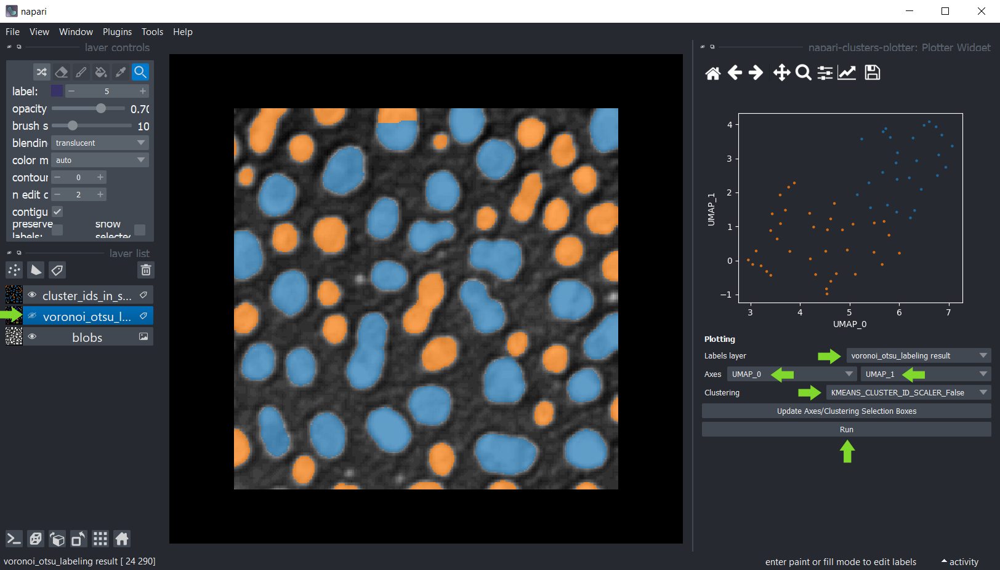

# Réduction de dimensionnalité et clustering interactifs

Le [napari-clusters-plotter](https://github.com/BiAPoL/napari-clusters-plotter) offre des outils pour effectuer divers algorithmes de réduction de dimensionnalité et méthodes de clustering de manière interactive dans Napari.

## Démarrage

Ouvrez une fenêtre de terminal et activez votre environnement conda :

```
conda activate devbio-napari-env
```

Ensuite, lancez Napari :

```
napari
```

Chargez le jeu de données d'exemple "Blobs" à partir du menu `Fichier > Ouvrir un exemple > clEsperanto > Blobs (de ImageJ)`.
Nous avons également besoin d'une image d'étiquettes. Vous pouvez la créer en utilisant le menu `Outils > Segmentation / étiquetage > Étiquetage Gauss-Otsu (clesperanto)`.

## Point de départ
Pour regrouper des objets selon leurs propriétés, le point de départ est une image d'intensité et une image d'étiquettes représentant une segmentation des objets.


## Mesures
La première étape consiste à extraire des mesures de l'image étiquetée et des pixels correspondants dans l'image d'intensité.
Vous pouvez utiliser le menu `Outils > Mesure > Regionprops (scikit-image, nsr)` pour cela.
Sélectionnez simplement l'image d'intensité, l'image d'étiquettes correspondante et les mesures `intensité`, `taille` et `forme` puis cliquez sur `Exécuter`.
Un tableau avec les mesures s'ouvrira :


Ensuite, vous pouvez sauvegarder et/ou fermer le tableau de mesures. Fermez également le widget Mesure.

## Traçage

Une fois les mesures effectuées, ces mesures ont été enregistrées dans les `caractéristiques` de la couche d'étiquettes qui a été analysée.
Vous pouvez ensuite tracer ces mesures en utilisant le menu `Outils > Mesure > Tracer les mesures (ncp)`.

Dans ce widget, vous pouvez sélectionner la couche d'étiquettes qui a été analysée et les mesures qui doivent être tracées
sur les axes X et Y. Si vous ne voyez pas d'options dans les boîtes de sélection des axes, mais que vous avez effectué des mesures, cliquez
sur `Mettre à jour les boîtes de sélection des axes/clustering` pour les actualiser. Cliquez sur `Exécuter` pour dessiner les points de données dans la zone de tracé.


Vous pouvez également sélectionner manuellement une région dans le tracé. Utilisez la souris pour dessiner un contour autour de la région d'intérêt. 
Le clustering manuel résultant sera également visualisé dans l'image originale. 
Pour optimiser la visualisation dans l'image, désactivez la visibilité de la couche d'étiquettes analysée.


Maintenez la touche SHIFT enfoncée tout en annotant les régions dans le tracé pour sélectionner manuellement plusieurs clusters.


## Réduction de dimensionnalité : UMAP, t-SNE ou ACP

Pour obtenir plus d'informations sur vos données, vous pouvez réduire la dimensionnalité des mesures, par exemple
en utilisant l'algorithme [UMAP](https://umap-learn.readthedocs.io/en/latest/), [t-SNE](https://scikit-learn.org/stable/modules/generated/sklearn.manifold.TSNE.html)
ou les algorithmes [ACP](https://scikit-learn.org/stable/modules/generated/sklearn.decomposition.PCA.html).
Pour les appliquer à vos données, utilisez le menu `Outils > Mesure > Réduction de dimensionnalité (ncp)`.
Sélectionnez l'image d'étiquettes qui a été analysée et dans la liste ci-dessous, sélectionnez toutes les mesures dont la dimensionnalité doit être réduite. 
Par défaut, toutes les mesures sont sélectionnées dans la boîte. Si vous ne voyez pas de mesures, mais que vous les avez effectuées, cliquez sur `Mettre à jour les mesures` pour actualiser la boîte. 
Vous pouvez en savoir plus sur les paramètres des deux algorithmes en survolant les points d'interrogation ou en cliquant dessus. 
Lorsque vous avez terminé la sélection, cliquez sur `Exécuter` et après un moment, le tableau des mesures réapparaîtra avec deux colonnes supplémentaires représentant les dimensions réduites du jeu de données. 
Ces colonnes sont automatiquement sauvegardées dans les `caractéristiques` de la couche d'étiquettes.


Ensuite, vous pouvez à nouveau sauvegarder et/ou fermer le tableau. Fermez également le widget de réduction de dimensionnalité.

## Clustering

Si les points de données sont clairement séparés, le clustering automatique peut être une option, en utilisant ces algorithmes implémentés :
* [Clustering k-means (KMEANS)](https://towardsdatascience.com/k-means-clustering-algorithm-applications-evaluation-methods-and-drawbacks-aa03e644b48a)
* [Clustering spatial hiérarchique basé sur la densité d'applications avec bruit (HDBSCAN)](https://hdbscan.readthedocs.io/en/latest/how_hdbscan_works.html)
* [Modèle de mélange gaussien (GMM)](https://scikit-learn.org/stable/modules/mixture.html)
* [Mean Shift (MS)](https://scikit-learn.org/stable/auto_examples/cluster/plot_mean_shift.html#sphx-glr-auto-examples-cluster-plot-mean-shift-py)
* [Clustering agglomératif (AC)](https://scikit-learn.org/stable/modules/generated/sklearn.cluster.AgglomerativeClustering.html)

Pour ce faire, cliquez sur le menu `Outils > Mesure > Clustering (ncp)` et sélectionnez la couche d'étiquettes analysée.
Cette fois, sélectionnez les mesures pour le clustering, par exemple sélectionnez _uniquement_ les mesures `UMAP`.
Sélectionnez la méthode de clustering `KMeans` et cliquez sur `Exécuter`.
Le tableau des mesures réapparaîtra avec une colonne supplémentaire `KMeans_CLUSTERING_ID` contenant l'ID de cluster de chaque point de données.


Ensuite, vous pouvez à nouveau sauvegarder et/ou fermer le tableau. Fermez également le widget de clustering.

## Traçage des résultats du clustering
Revenez au widget Plotter en utilisant le menu `Outils > Mesure > Tracer les mesures (ncp)`.
Sélectionnez `UMAP_0` et `UMAP_1` comme axes X et Y et `KMeans_CLUSTERING_ID` comme `Clustering`, puis cliquez sur `Exécuter`.

