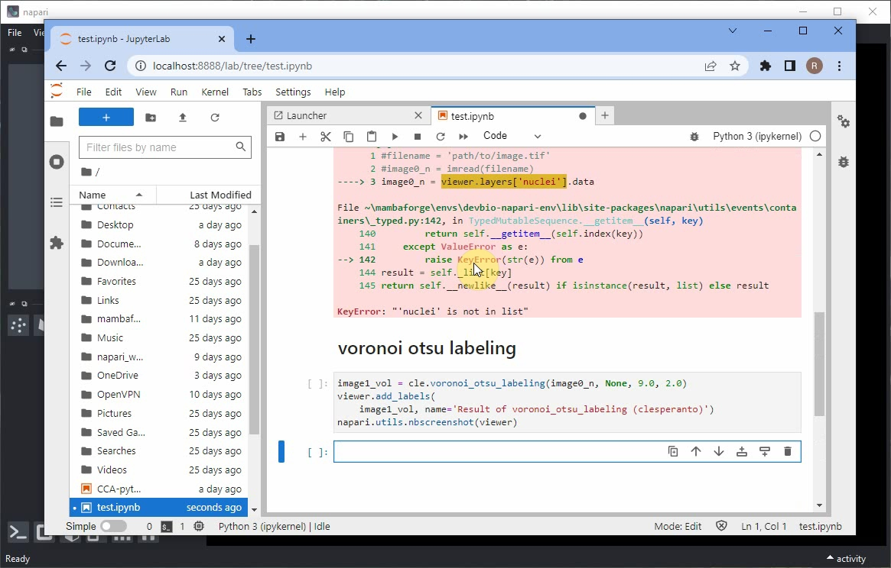
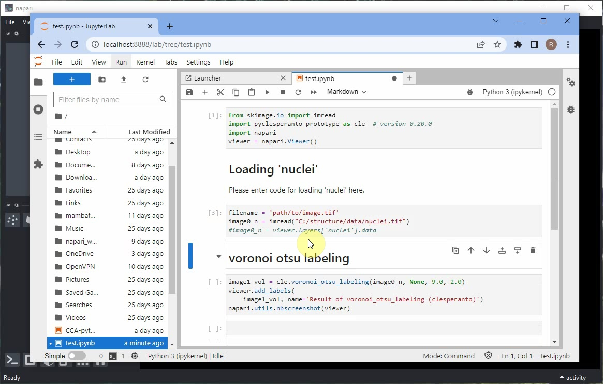
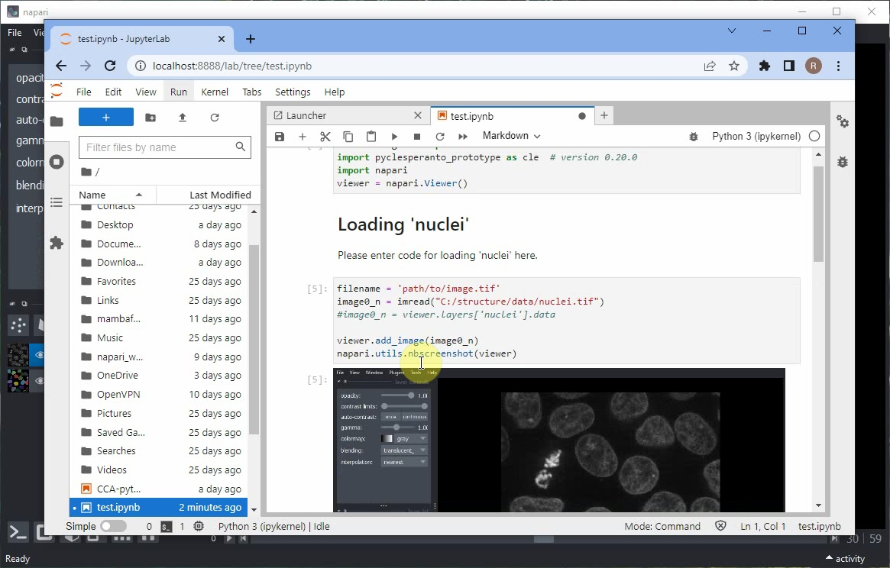
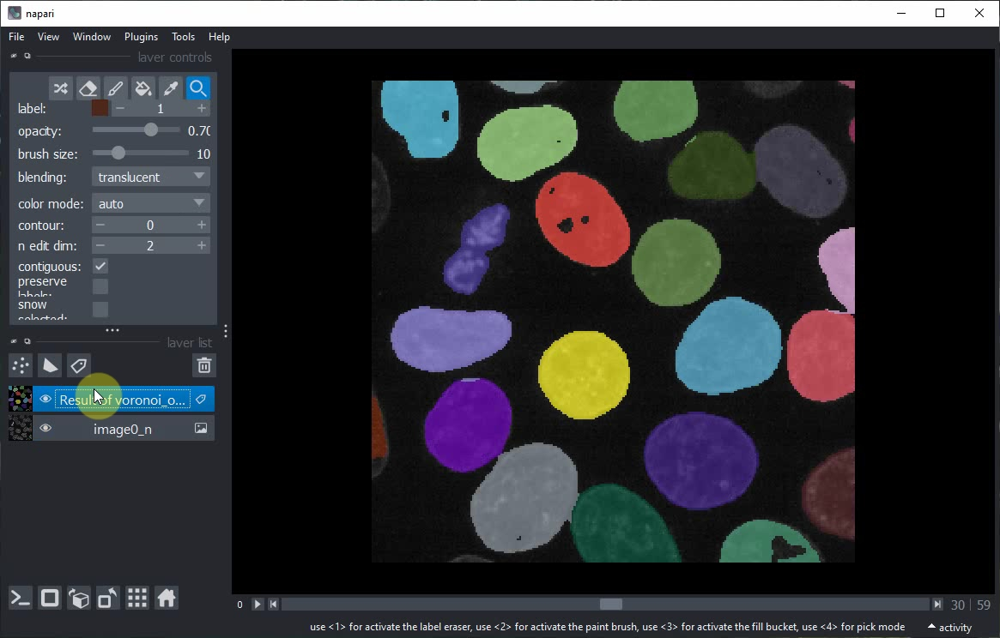

# Génération de Notebooks Jupyter à partir de l'Assistant Napari

Après avoir configuré un flux de travail à l'aide de l'Assistant Napari, nous pouvons exporter le code Python, par exemple sous forme de Notebook Jupyter.

Ce tutoriel est également disponible en vidéo [export_notebooks.mp4](images/export_notebooks.mp4)

Dans le panneau Assistant, cliquez sur le bouton `Generate Code...` et le menu `Export Jupyter Notebook using Napari`.


Jupyter lab s'ouvrira et vous demandera de sélectionner un Kernel. Conservez l'option par défaut et cliquez sur `Select`.


Lors de l'exécution du notebook, des erreurs peuvent apparaître, par exemple lors du chargement des données.


Faites défiler jusqu'à la fin du message d'erreur pour lire ce qui n'a pas fonctionné.



Remontez à la cellule du notebook qui n'a pas fonctionné et modifiez le code pour qu'il utilise la fonction `imread` pour charger l'image depuis le disque.



Si vous n'avez pas encore enregistré l'image `nuclei` sur le disque, utilisez le menu `File > Save current Layer(s)` pour enregistrer la couche `nuclei` en tant que fichier `.tif`.


Ensuite, relancez le notebook et examinez le résultat. La visionneuse Napari qui s'est ouverte en arrière-plan sera également affichée dans le notebook.


Si vous souhaitez également visualiser les données brutes de l'image avec le résultat de la segmentation, ajoutez ces lignes à votre code :

```python
viewer.add_image(image0_n)
napari.utils.nbscreenshot(viewer)
```



Relancez le notebook, ou modifiez manuellement l'ordre des couches dans la visionneuse Napari. À la fin, cela devrait ressembler à ceci.



Voilà ! Vous avez maintenant généré un Notebook Jupyter à partir d'un flux de travail de l'Assistant Napari. Ce notebook documente votre travail de manière reproductible et peut être partagé avec d'autres.